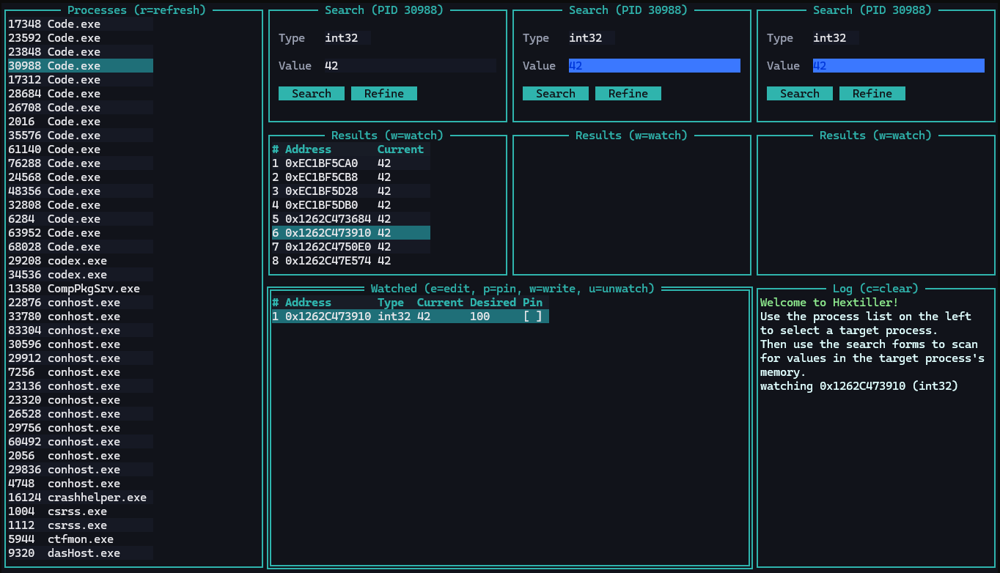

# HexTiller

HexTiller is a TUI for inspecting and manipulating process memory on Windows and Linux. I made this as a safe alternative to other memory editors that often come bundled with problematic 'extras'.

This tool is intended for my personal use, but I put it here in case anyone else finds it useful.

## Features
- Browse and search process memory.
- Watch, edit, pin, and write memory addresses.
- Keyboard and mouse support.
- No installation required; just run the executable.

## Quick start
1. Run `hextiller` (or `hextiller.exe` on Windows).
2. Select a process in the left pane.
3. In any Search pane: choose a type, enter a value, then press `Search`.
4. Change the value in the target app, then press `Refine` to narrow things down.
5. In Results, press `w` to watch an address.
6. In Watched, use `e` to edit the desired value, `p` to pin, and `w` to write once.

## Platform notes
- **Linux**: uses the `process_vm_readv`/`process_vm_writev` syscalls. You can only attach to processes owned by your user; run with `sudo` (or `CAP_SYS_PTRACE`) to target others. If Yama `ptrace_scope` is 2+ you'll need `CAP_SYS_PTRACE` regardless.
